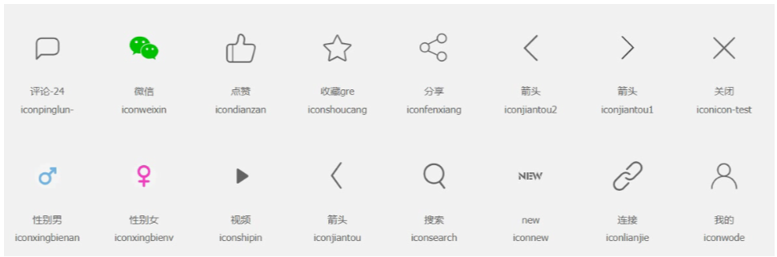
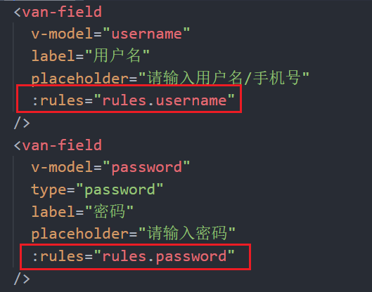
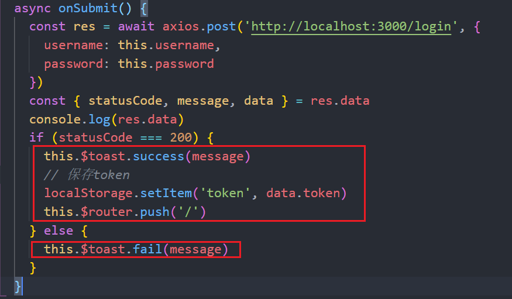

# eslint配置

## 安装eslint插件

> 给vscode安装eslint插件，安装了这个插件，代码不符合规范的时候。编辑器直接会提醒错误。

+ 在package.json配置

```js
// 当保存的时候，eslint自动帮我们修复错误
"editor.codeActionsOnSave": {
  "source.fixAll": true
},
```

## prettier 

> 安装vscode的prettier插件

+ 配置

```js
// 当保存的时候使用prettier进行格式
"editor.formatOnSave": true,
```

+ 在项目的根目录创建prettier的配置文件 `.prettierrc`

```json
{
  "semi": false,
  "singleQuote": true
}
```

## prettier和eslint冲突

函数前面是否添加空格的问题

修改eslint的规则 在package.json配置

```js
"rules": {
  "semi": ["error", "never"],
  "space-before-function-paren": ["error", "never"]
}
```


# 样式处理

+ 在styles中准备`common.less`文件

```less
* {
  margin: 0;
  padding: 0;
  list-style: none;
  box-sizing: border-box;
}

```

+ 在`main.js`中引入


+ 在styles中准备`iconfont.less`

+ 在main.js中引入




# 路由处理

+ 在`router/index.js`文件中提供路由对象

```js
import Vue from 'vue'
import VueRouter from 'vue-router'
import Login from '../views/Login.vue'
import Register from '../views/Register.vue'

Vue.use(VueRouter)

const router = new VueRouter({
  routes: [
    { path: '/login', component: Login },
    { path: '/register', component: Register }
  ]
})

export default router

```

+ 在`views`创建两个组件`Login.vue` 和 `Register.vue`
+ 在main.js中导入路由对象，并且关联到vm上
+ 在根组件`App.vue`配置路由出口


# 登录功能

## 开启git分支

```js
git checkout -b login
```


## 封装一个通用的头部组件

+ 在`components`中创建`HmHeader.vue`文件

```js
<template>
  <div class="hm-header">
    <div class="back">
      <span class="iconfont iconjiantou2"></span>
    </div>
    <div class="title">我的关注</div>
    <div class="extra"></div>
  </div>
</template>

<script>
export default {

}
</script>

<style lang="less">
.hm-header {
  height: 40px;
  border-bottom: 1px solid #ccc;
  display: flex;
  line-height: 40px;
  .back,
  .extra {
    width: 40px;
    text-align: center;
  }
  .title {
    flex: 1;
    text-align: center;
    font-size: 16px;
    font-weight: 700;
  }
}
</style>
```

+ 在`main.js`中全局注册

```js
import HmHeader from './components/HmHeader.vue'

// 全局注册组件
Vue.component('hm-header', HmHeader)
```


+ 可以在登录或者注册组件中渲染该组件

```html
<hm-header></hm-header>
```

+ 给hmHeader组件提供插槽 让内容不写死

```js
<div class="title"><slot></slot></div>
```


+ 给箭头注册点击事件，点击需要返回到上一页。

@click="$router.go(-1)"

## hmLogo的封装

+ 在`components`中创建一个`HmLogo组件`  就是new图标 在里面放入公共图标  设置样式
+ 在mian.js中全局注册
+ 在登录和注册中使用


## 使用vant-ui提供的表单

+ 在`main.js`中引入表单组件

```js
import { Button, Field, Form } from 'vant'

Vue.use(Button)
Vue.use(Field)
Vue.use(Form)
```


+ 在login.vue中使用表单组件

```html
    <!-- 表单 -->
    <van-form>
      <van-field
        v-model="username"
        label="用户名"
        placeholder="请输入用户名/手机号"
      />
      <van-field
        v-model="password"
        type="password"
        label="密码"
        placeholder="请输入密码"
      />
      <div style="margin: 16px;">
        <van-button round block type="info" native-type="submit">
          提交
        </van-button>
      </div>
    </van-form>
```

+ 在data中提供数据

```js
export default {
  data() {
    return {
      username: '',
      password: ''
    }
  }
}
```


## 增加表单校验的功能

+ 在data中提供rules规则 可以配多个规则. 
+ 是根据文档的规则来配置的 在文档的最下方有具体说明

```js
rules: {
  username: [
      //required 必传的  trigger 本项规则的触发时机 	onChange就是改变时触发
    { required: true, message: '请填写用户名', trigger: 'onChange' },
    {
      pattern: /^\d{5,11}$/, //pattern 通过正则来校验
      message: '用户名只能是5-11位数字', //错误提示
      trigger: 'onChange' //改变时触发
    }
  ],
  password: [
    { required: true, message: '请填写密码', trigger: 'onChange' },
    {
      pattern: /^\w{3,9}$/,
      message: '用户密码只能是3-9位',
      trigger: 'onChange'
    }
  ]
}
```

+ 给van-field组件通过`rules`属性配置规则




## 关于接口的说明

+ 解压`Typescript-Node-Koa2.zip`
+ 在这个文件夹下使用`yarn start`命令启动服务器

```js
如果启动报错了，，，，保证你的node版本是12这个版本
```

+ 这个项目不需要导入数据，因为这个项目没有使用mysql数据库，使用的是sqlite
+ 测试接口是否可用

```
http://localhost:3000/post?pageIndex=1&pageSize=2&category=8
```


+ 接口文档的使用

```js
所有的接口基准路径：  http://localhost:3000
```


## 发送请求进行登录

+ 安装axios

```js
yarn add axios
```

+ 在`login.vue`中引入axios

```js
import axios from 'axios'
```

+ 给van-form 注册submit事件

  <van-form @submit="onSubmit">

+ 在sumit事件中发送ajax请求

```js
 methods: {
    async onSubmit() {
        //post方式 添加/新增(登录一般都是post）。参数一 url地址 参数二 里面需要传data参数的 直接加一个对象传进去
      const res = await axios.post('http://localhost:3000/login', {
        username: this.username,
        password: this.password
      })
      const { statusCode, message } = res.data
      if (statusCode === 200) {
        alert(message)
        this.$router.push('/')
      } else {
        alert(message)
      }
    }
  }
```


## 登录的提示消息

+ 在main.js引入`toast`组件

```js
import { Toast } from 'vant'

Vue.use(Toast)
```

+ 在组件中提示消息 
  1. 根据文档设置提示消息 
  2. 登录成功后把token存起来.    localStorage.setItem('token', data.token)




## 提交代码，合并分支

+ `git add .`
+ `git commit -m '登录完成'`
+ `git checkout master`
+ `git merge login`
+ `git push`


# 注册功能

## 基本功能

注意 导入axios

```less
<template>
  <div class="register">
    <hm-header>注册</hm-header>
    <hm-logo></hm-logo>
    <van-form @submit="onSubmit">
      <van-field
        v-model="user.username"
        label="用户名"
        placeholder="请输入用户名/手机号"
        :rules="rules.username"
      />
      <van-field
        v-model="user.nickname"
        label="昵称"
        placeholder="请输入昵称"
        :rules="rules.nickname"
      />
      <van-field
        v-model="user.password"
        type="password"
        label="密码"
        placeholder="请输入密码"
        :rules="rules.password"
      />
      <div style="margin: 16px;">
        <van-button round block type="info" native-type="submit">
          注册
        </van-button>
      </div>
    </van-form>
    <p class="tips">已有账号？去<router-link to="/login">登录</router-link></p>
  </div>
</template>

<script>
import axios from 'axios'
export default {
  data() {
    return {
      user: {
        username: '',
        password: '',
        nickname: ''
      },
      rules: {
        username: [
          { required: true, message: '请填写用户名', trigger: 'onChange' },
          {
            pattern: /^\d{5,11}$/,
            message: '用户名只能是5-11位数字',
            trigger: 'onChange'
          }
        ],
        password: [
          { required: true, message: '请填写密码', trigger: 'onChange' },
          {
            pattern: /^\w{3,9}$/,
            message: '用户密码只能是3-9位',
            trigger: 'onChange'
          }
        ],
        nickname: [
          { required: true, message: '请填写昵称', trigger: 'onChange' },
          {
            pattern: /^[\u4e00-\u9fa5]{2,5}$/,
            message: '用户昵称只能是2-5位中文',
            trigger: 'onChange'
          }
        ]
      }
    }
  },
  methods: {
    async onSubmit() {
      const res = await axios.post('http://localhost:3000/register', this.user)
      console.log(res)
      const { statusCode, message } = res.data
      if (statusCode === 200) {
        this.$toast.success(message)
        this.$router.push('/login')
      } else {
        this.$toast.fail(message)
      }
    }
  }
}
</script>

<style lang="less">
.register {
  .tips {
    font-size: 14px;
    text-align: right;
    padding-right: 20px;
    a {
      color: orange;
    }
  }
}
</style>

```


## 路由传参   (此项目直接用params)

1.把参数拼接到地址栏中 最笨的方法 一般不用 不合理 麻烦

```js
this.$router.push('/login?username=zs&password=123') //传简单一点的参数

this.$router.push(
  `/login?username=${this.user.username}&password=${this.user.password}`
) //还可以拼变量传参

这个通过this.$router.query就可以拿到参数
```


2.在路由跳转的时候，指定一个query对象 对象里就是要传的参数

缺点：会把参数传到地址栏里

```js
this.$router.push({
  path: '/login',
  query: { 
    username: this.user.username,
    password: this.user.password
  }
})
```


+ 在路由跳转的时候，指定params参数

```js
this.$router.push({
  name: 'login',
  params: {
    username: this.user.username,
    password: this.user.password
  }
})
```

==如果是params传参，就不能使用path，需要使用name==


## login.vue 接收路由传过来的参数

created() {

​    // 获取到路由中的参数，赋值给username和password

​    const { username, password } = this.$route.params

​    this.username = username

​    this.password = password

  }

# axios的优化

## 把axios绑定到vue的原型

在`main.js`中

```js
import axios from 'axios'

// 把axios挂在到vue的原型
Vue.prototype.$axios = axios
```


## 配置axios的基准地址

在`main.js`中

```js
// 配置axios的默认基准地址
axios.defaults.baseURL = 'http://localhost:3000'
```

# scoped

+ 在定义组件的时候，如果希望样式只影响当前组件，那么需要给style标签添加`scoped`属性 （在组件里写样式就加上）

```less
<style lang="less" scoped>
.register {
  .tips {
    font-size: 14px;
    text-align: right;
    padding-right: 20px;
    a {
      color: orange;
    }
  }
}
</style>
```


+ 原理

```js
/*
  scoped会给当前组件中所有的样式添加一个属性选择器 data-v-xxxx
  scoped会给当前组件中所有的元素也添加这个属性  data-v-xxxx
*/ 
```

