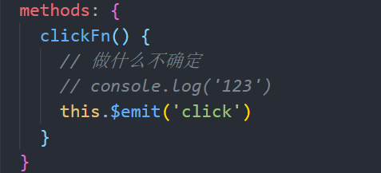

# vant-ui导入的问题

## toast的问题

+ 每个组件单独导入

```js
import {Toast} from 'vant'

Toast('hello')
```


+ 在`main.js`中导入

```js
import {Toast} from 'vant'

// 给vue的原型上添加一个方法 $toast
Vue.use(Toast)


// 在组件中
this.$toast('哈哈哈')
```


# 个人中心

## 配置个人中心路由

+ 在`views`创建`user.vue`

+ `router/index.js`配置路由规则

```js
import User from '../views/User.vue'

routes: [
  { path: '/login', component: Login, name: 'login' },
  { path: '/register', component: Register, name: 'register' },
  { path: '/user', component: User, name: 'user' }
]
```


## 个人中心-头部

```less
<template>
  <div class="user">
    <div class="header">
      <div class="avatar">
        
      </div>
      <div class="info">
        <p class="name"><span class="iconfont iconxingbienv"> 火星网友</span></p>
        <p class="time">2020-20-20</p>
      </div>
      <div class="arrow">
        <span class="iconfont iconjiantou1"></span>
      </div>
    </div>
    <div class="nav">
      <hm-navbar></hm-navbar>
    </div>
  </div>
</template>

<script>
export default {

}
</script>

<style lang="less" scoped>
.user {
  .header {
    display: flex;
    height: 120px;
    border-bottom: 5px solid #ccc;
    align-items: center;
    padding: 0 20px;
    .avatar {
      img {
        width: 70px;
        height: 70px;
        border-radius: 50%;
      }
    }
    .info {
      flex: 1;
      padding-left: 20px;
      font-size: 14px;
      color: #333;
      .name {
        margin-bottom: 10px;
      }
      .time {
        color: #999;
      }
    }
  }
  .nav {
    padding-left: 20px;
  }
}
</style>

```

## 封装navbar组件

+ 在`components`中新建`HmNavBar.vue`

```less
<template>
  <div class="hm-navbar">
    <div class="title">我的关注</div>
    <div class="content">关注的用户</div>
    <div class="arrow"><span class="iconfont iconjiantou1"></span></div>
  </div>
</template>

<script>
export default {

}
</script>

<style lang="less" scoped>
.hm-navbar {
  height: 50px;
  border-bottom: 1px solid #ccc;
  display: flex;
  padding-right: 20px;
  line-height: 50px;
  font-size: 16px;
  .content {
    flex: 1;
    text-align: right;
    color: #999;
  }
  .arrow {
    padding-left: 10px;
    font-size: 16px;
  }
}
</style>

```


+ 在`main.js`中全局注册

```js
import HmNavBar from './components/HmNavBar.vue'

Vue.component('hm-navbar', HmNavBar)
```


## navBar组件使用插槽

+ 封装


+ 使用插槽


## 发送请求获取个人信息

1.发请求前 先在login.vue里面把ID和token存起来（发送请求成功的时候存） 因为接口地址要求拼接id

localStorage.setItem('userId', data.user.id) 

2. 在user.vue里发生请求 在created钩子函数中，发送请求，获取个人信息 (这个发送请求的时候是页面还没有被渲染出来的时候 )

   ⚠️注意：1.要在请求地址拼接动态id（根据接口）  2.要配置请求头 


+ 在data中提供info用于存储数据 data中的数据才能用去渲染

```js
  data() {
    return {
      info: {}
    }
  },
```


+ 在created钩子函数中，发送请求，获取个人信息 

```js
  async created() {
      //获取之前存的ID和token
    const userId = localStorage.getItem('userId')
    const token = localStorage.getItem('token')
    // 发送ajax请求，获取个人信息
    const res = await this.$axios.get(`/user/${userId}`, {
      // 配置请求头 
      headers: {
        Authorization: token //Authorization 这个是后端提供的 要验证的 要验证的就是token 每次发请求都加这句 很麻烦 下面会通过axios的拦截器拦截解决这个问题
      }
    })
    // console.log(res)
    const { statusCode, data } = res.data
    if (statusCode === 200) {
      this.info = data
    }
  }
```


## 渲染个人中心的数据

+ 头像问题  图片地址要拼接基准地址 避免写死


+ 过滤器过滤时间问题

在main.js中定义一个全局的过滤器，安装moment的依赖包


+ 性别的渲染 


⚠️⚠️重点：

1.验证是否有token 有才跳转到个人中心 】（通过导航守卫）

2.验证token是否有效 有跳转 没有 还是登录页面 删除无效的token及userid （通过拦截器 请求和响应拦截器） 

​	前端只知道有没有token 服务器才知道token有没有失效


# 导航守卫-拦截未登录的用户

+ 在`router/index.js`中配置全局的前置导航守卫
+ 如果是去user页面，判断用户是否登录,如果用户登录，放行，如果没有登录，跳转到登录页面
+ 如果不是去user页面，直接放行

```js
// 全局的导航守卫（路由的钩子函数 beforeEach afterEach）
// to: 到哪儿去
// from: 从哪儿来
// next(): 代表放行
router.beforeEach(function(to, from, next) {
  // console.log('全局的前置导航守卫')
  // console.log('to', to)
  // console.log('from', from)
  const token = localStorage.getItem('token')
  // 如果去的页面是 user页面，就需要判断是否有token
  if (to.path === '/user') {
    // 判断是否有token,如果没有token，去登录，如果有token，放走
    if (token) {
      next()
    } else {
      router.push('/login')
    }
  } else {
    next()
  }
})
```

## 路由的钩子函数

+ 全局的
  + router.beforeEach
  + router.afterEach
+ 路由级别的钩子`{path: '', component: User, beforeEach}`
  + beforeEach
  + afterEach

+ 组件级别的钩子
  + boforeRouterEnter
  +  `beforeRouteUpdate`  
  +  beforeRouteLeave 


## 拦截token失效的用户

 在user发送请求成功之后 再做一个判断


# axios的拦截器拦截

在此项目中是在main.js中配置 

## 使用请求拦截器添加token

可以给所有的请求做通用配置 例如给所有的请求添加token 这样就不用每次发请求都加一下token了


## 使用响应拦截器拦截token失效的响应


# 用户中心-跳转到编辑资料

给用户中心头部注册事件 跳转到编辑页面

## 封装navBar支持点击事件 进行跳转页面

用的是子传父

1.给封装的nacbar注册点击事件 


2.当点击div的时候，触发组件的click事件



3.使用组件的时候，就可以注册点击事件了 （这里注册的点击事件名要和第二部触发的事件名一致


# 编辑页面

## 拦截未登陆的用户

在index.js里 

