# 退出功能

##try catch语法 介绍

async logout() {

​      try {

​        //try里面写有可能要报错的代码

​        await this.$dialog.confirm({

​          title: '温馨提示',

​          message: '亲，你确定要退出这个系统吗?'

​        })

​        // 能到这说明点了确定

​        localStorage.removeItem('token')

​        localStorage.removeItem('userId')

​        this.$router.push('/login')

​        this.$toast.success('退出成功')

​      } catch {

​        //catch是捕获的意思 也就是try里面的代码报错之后catch才会执行 try里面的代码不报错 catch是不会执行的

​        this.$toast('取消退出')

​      }


+ 在`user.vue`中添加了一个退出的导航

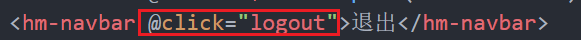

+ 在methods中提供一个logout函数

```js
思路：
1. 有一个弹窗提醒
2. 如果点击了取消，不退出
3. 如果点击了确定
	3.1 删除token和userId
  3.2 跳转到登录页面
  3.3 给了一个提示消息
```


+ 在main.js中注册 Dialog组件

```js
import { Dialog } from 'vant'
Vue.use(Dialog)
```


+ 使用弹窗提醒

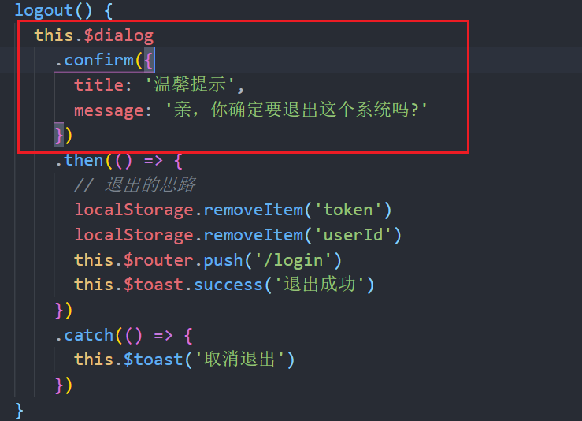

# 关于路由报错的问题

+ 地址栏报错

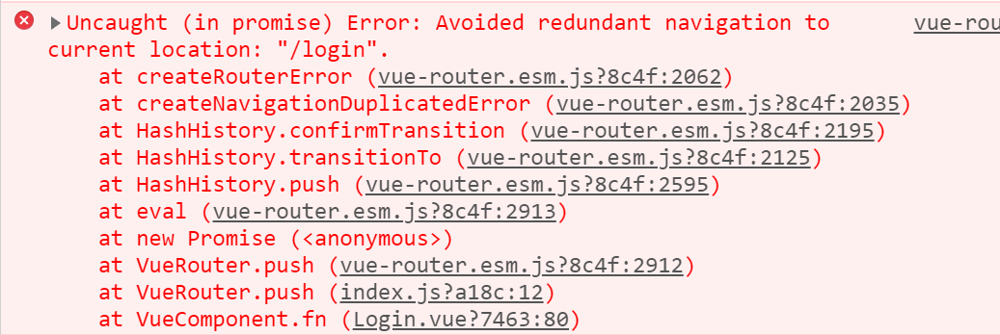

==原因：重复的跳转到同一个路由==

+ 解决1

```js
this.$router.push('/login').catch(err => err)
```

+ 解决2

在`router/index.js`中把原型上的push方法重写

```js
const originalPush = VueRouter.prototype.push
VueRouter.prototype.push = function push(location) {
  return originalPush.call(this, location).catch(err => err)
}
```


# 编辑资料

## 静态结构

```less
<template>
  <div class="user-edit">
    <hm-header>编辑资料</hm-header>
    <div class="avatar">
      
    </div>
    <div class="nav">
      <hm-navbar>
        <template>昵称</template>
        <template #content>火星网友</template>
      </hm-navbar>
      <hm-navbar>
        <template>密码</template>
        <template #content>***</template>
      </hm-navbar>
      <hm-navbar>
        <template>性别</template>
        <template #content>男</template>
      </hm-navbar>
    </div>
  </div>
</template>

<script>
export default {}
</script>

<style lang="less" scoped>
.avatar {
  padding: 30px 0;
  text-align: center;
  img {
    width: 70px;
    height: 70px;
    border-radius: 50%;
  }
}
.nav {
  padding-left: 20px;
}
</style>
```


## 动态渲染

+ 发送ajax请求数据

+ 渲染动态的内容

  created() {

  ​    this.getInfo()

    },


  async getInfo() {

  ​      const userId = localStorage.getItem('userId')

  ​      const res = await this.$axios.get(`/user/${userId}`)

  ​      const { statusCode, data } = res.data

  ​      if (statusCode === 200) {

  ​        this.info = data

  ​      }

  ​    },

发完请求之后 拿到info 就可以渲染数据了

## 修改昵称

+ 使用Dialog组件

```html
    <van-dialog v-model="show" title="修改昵称" show-cancel-button>
      <van-field v-model="nickname" placeholder="请输入用户新昵称" />
    </van-dialog>
```

+ 在data中提供一个show属性

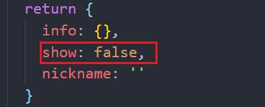

+ 点击昵称的时候，需要显示出来

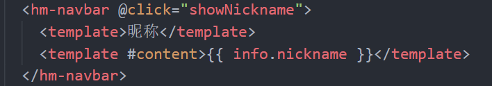

+ 显示框

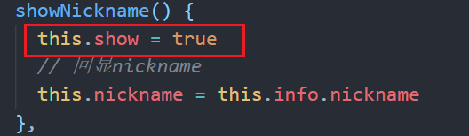


+ 回显nickname

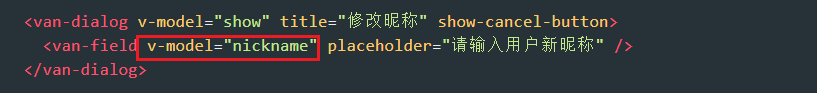

==⚠️⚠️不能直接和info.nickname绑定 跟todos一样 要先把nickname先存起来 避免和info.nickname双向绑定 一旦和info.nickname双向绑定 弹框修改了昵称 就算点取消也会修改昵称 所以要和自己的info.nickname绑定==

+ 在data中提供nickname

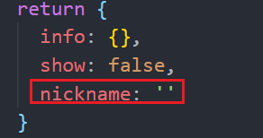

+ 显示对话框的时候，回显Nickname

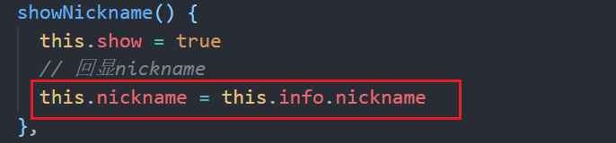


## 点击确定，修改昵称

+ 给dialog注册confirm事件

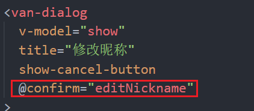

+ 提供editNickname方法

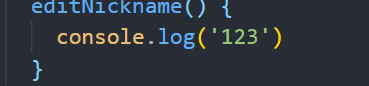

+ 发送请求，修改

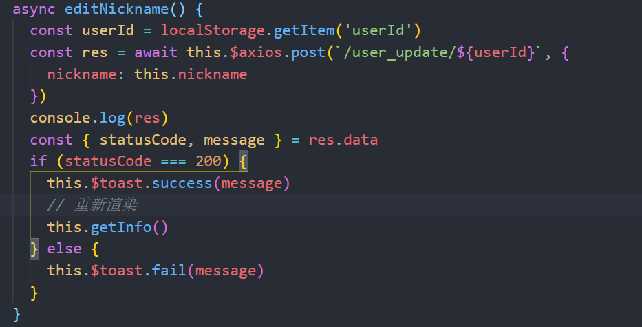


## 深度选择器

> 在某个组件中给子组件设置样式， 在某个组件中需要修改组件库的样式

如果修改是某个子组件的根元素的样式，是可以直接修改。

如果修改的是某个子组件内部元素的样式，样式会不生效，但是如果希望样式能够影响到子组件的内部元素，需要添加一个选择器，*深度选择器*

```css
>>>  css中
/deep/ less中
::v-deep  scss
```


## 修改性别

+ 修改性别的对话框

```html
    <!-- 性别 -->
    <van-dialog v-model="showGender" title="修改性别" show-cancel-button>
      <van-radio-group v-model="gender">
        <van-cell-group>
          <van-cell title="男" clickable @click="gender = 1">
            <template #right-icon>
              <van-radio :name="1" />
            </template>
          </van-cell>
          <van-cell title="女" clickable @click="gender = 0">
            <template #right-icon>
              <van-radio :name="0" />
            </template>
          </van-cell>
        </van-cell-group>
      </van-radio-group>
    </van-dialog>
```


