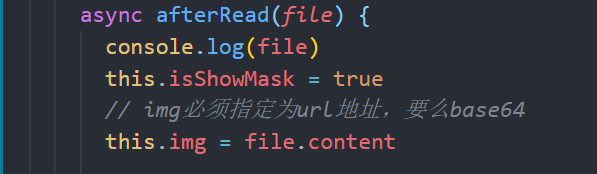
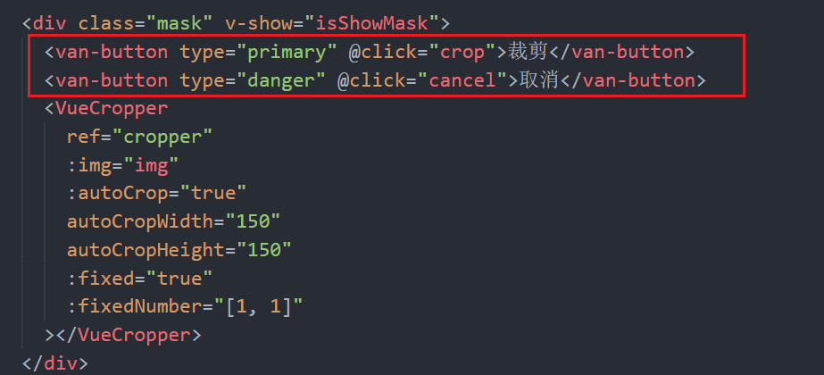
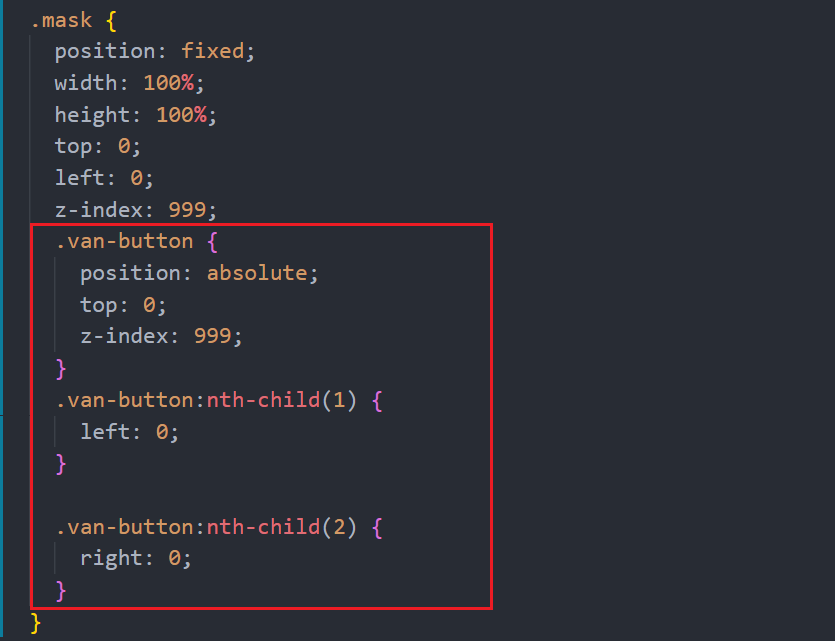
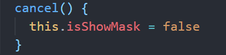
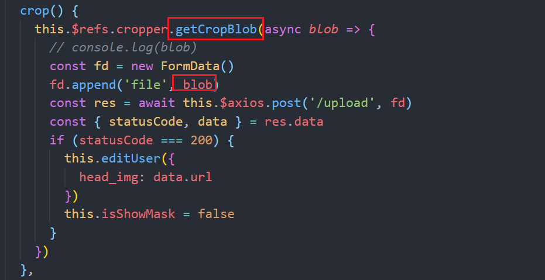

# 图片上传

## 格式和大小校验 

在上传图片之前验证。也是在afterRead(file) 里验证

```js
console.log(file.file)
// 是否超出范围
const isLimit = file.file.size / 1024 >= 20
if (isLimit) {
  this.$toast.fail('上传的图片不能超过20kb哟')
  return
}
// 限制图片的格式
const isGif = file.file.type === 'image/gif'
const isPng = file.file.type === 'image/png'
const isJpg = file.file.type === 'image/jpeg'
if (!isGif && !isPng && !isJpg) {
  this.$toast.fail('上传的图片只能是gif|png|jpg')
  return
}
```


## vue-cropper使用 （图片裁剪）

### 基本步骤

+ 1。安装

```js
yarn add vue-cropper
```

+ 2。局部导入

```js
import { VueCropper } from 'vue-cropper'
export default {
  components: {
    VueCropper
  }
}
```

+ 提供父盒子的样式 (知识点讲解)

```js
<style lang="less" scoped>
// 使用vue-cropper插件，必须指定父盒子的宽度和高度
.demo {
  position: fixed;
  width: 100%;
  height: 100%;
  z-index: 9;
}
</style>
```


### 常见配置

| 名称            | 功能                                                   | 默认值                 | 可选值                            |
| --------------- | ------------------------------------------------------ | ---------------------- | --------------------------------- |
| img             | 裁剪图片的地址                                         | 空                     | url 地址 \|\| base64 \|\| blob    |
| outputSize      | 裁剪生成图片的质量                                     | 1                      | 0.1 - 1                           |
| outputType      | 裁剪生成图片的格式                                     | jpg (jpg 需要传入jpeg) | jpeg \|\| png \|\| webp           |
| info            | 裁剪框的大小信息                                       | true                   | true \|\| false                   |
| canScale        | 图片是否允许滚轮缩放                                   | true                   | true \|\| false                   |
| autoCrop        | 是否默认生成截图框                                     | false                  | true \|\| false                   |
| "autoCropWidth" | 默认生成截图框宽度                                     | 容器的80%              | 0~max                             |
| autoCropHeight  | 默认生成截图框高度                                     | 容器的80%              | 0~max                             |
| fixed           | 是否开启截图框宽高固定比例                             | true                   | true \| false                     |
| fixedNumber     | 截图框的宽高比例                                       | [1, 1]                 | [宽度, 高度]                      |
| full            | 是否输出原图比例的截图                                 | false                  | true \| false                     |
| fixedBox        | 固定截图框大小 不允许改变                              | false                  | true \| false                     |
| canMove         | 上传图片是否可以移动                                   | true                   | true \| false                     |
| canMoveBox      | 截图框能否拖动                                         | true                   | true \| false                     |
| original        | 上传图片按照原始比例渲染                               | false                  | true \| false                     |
| centerBox       | 截图框是否被限制在图片里面                             | false                  | true \| false                     |
| high            | 是否按照设备的dpr 输出等比例图片                       | true                   | true \| false                     |
| infoTrue        | true 为展示真实输出图片宽高 false 展示看到的截图框宽高 | false                  | true \| false                     |
| maxImgSize      | 限制图片最大宽度和高度                                 | 2000                   | 0-max                             |
| enlarge         | 图片根据截图框输出比例倍数                             | 1                      | 0-max(建议不要太大不然会卡死的呢) |
| mode            | 图片默认渲染方式                                       | contain                | contain , cover, 100px, 100% auto |


### ref与$refs的使用

+ ref可以给一个DOM对象或者组件添加引用 (知识点讲解)

```js
      <h1 ref="aa">vue的例子</h1>
      <p ref="bb">{{msg}}</p>
      <demo ref="cc"></demo>
```


+ 可以通过`this.$refs`获取到当前组件上所有的引用 (知识点讲解)

```js
// 如果获取的是DOM，进行DOM的操作
this.$refs.aa.style.backgroundColor = 'red'
// 如果获取的是组件，调用组件提供的方法
this.$refs.cc.sayHi()
```

### 获取裁剪后的图片数据 (知识点讲解)

```js
 // 裁剪的是图片的base64
this.$refs.cropper.getCropData(data => {
  // do something
  console.log(data) 
})
// 裁剪的是图片
this.$refs.cropper.getCropBlob(async data => {
  // do something
  console.log(data) //data就是裁剪后的数据/图片
})
```

### 在编辑资料中使用裁剪框

+ 局部导入

```js
import { VueCropper } from 'vue-cropper'
export default {
  components: {
    VueCropper
  },
}
```

+ 3。在html结构中添加一个mask盒子 在mask中渲染了裁剪框 默认是隐藏的 

```js
    <div class="mask" v-show="isShowMask">
      <VueCropper></VueCropper>
    </div>
```

+ mask的样式

```less
.mask {
  position: fixed;
  width: 100%;
  height: 100%;
  top: 0;
  left: 0;
  z-index: 999;
}
```

+ 4。控制mask的显示和隐藏 用v-show


+ 5。选择完图片，让mask显示，并且动态设置裁剪的图片的地址




6. 配置裁剪框 

    <VueCropper

   ​        ref="cropper"

   ​        :img="img"

   ​        :autoCrop="true"

   ​        autoCropWidth="150"

   ​        autoCropHeight="150"

   ​        :fixed="true"

   ​        :fixedNumber="[1, 1]"

   ​      \></VueCropper>

### 添加裁剪和取消功能

+ 7.提供裁剪和取消的按钮



+ 提供两个按钮的样式、



+ 8.取消功能 只需要隐藏裁剪框就行



+ 9.裁剪功能  （选文件现在只需要显示裁剪框 修改头像/裁剪头像 已经是通过点击裁剪按钮了）

  需要通过ref refs 配合使用 通过this.$refs.cropper.getCropBlob方法来获取裁剪后图片的数据 拿到数据再发送请求




# 我的关注

## 配置路由

