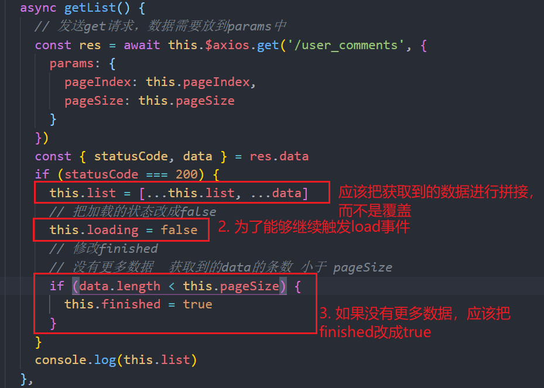
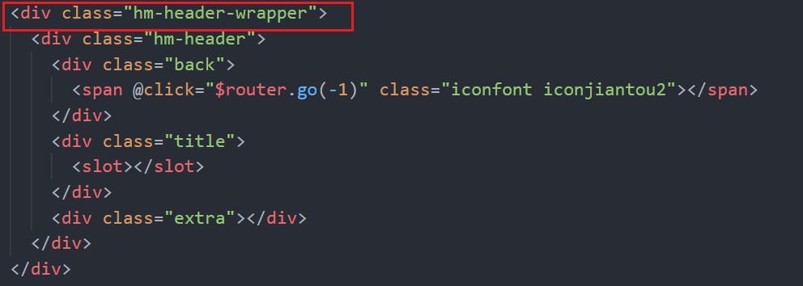
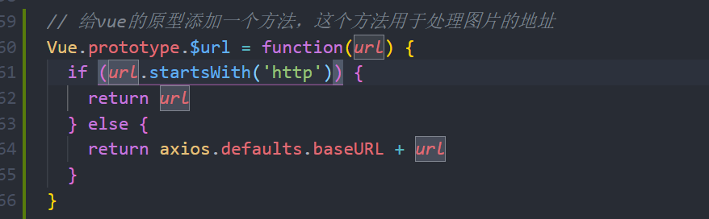
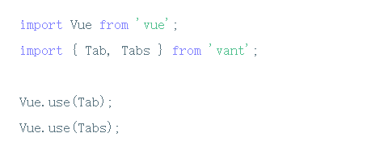
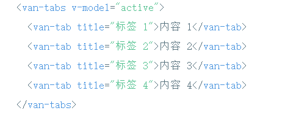
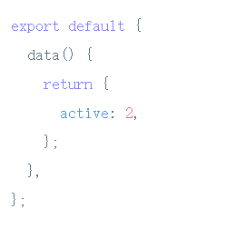
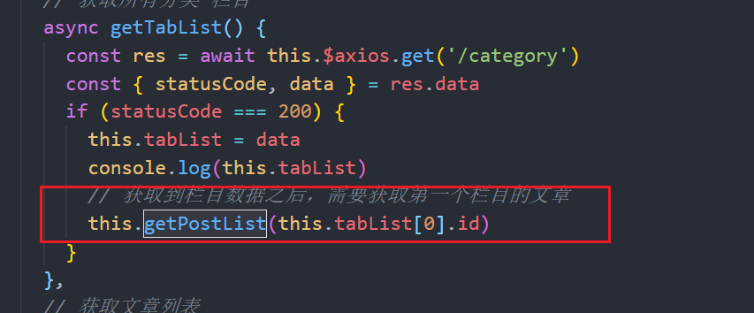
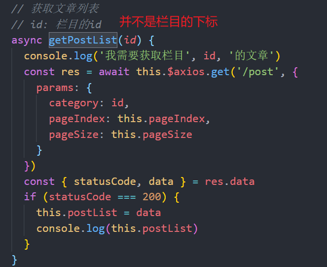
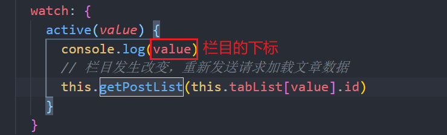

# 我的跟帖

## List组件的基本使用

+ 引入 `vant.js`

```js
import { List } from 'vant';

Vue.use(List);
```

+ 使用结构

```html
<van-list
  v-model="loading"
  :finished="finished"
  finished-text="没有更多了"
  @load="onLoad"
>
  <!-- 跟帖的数据 -->
</van-list>
```

+ 提供两个数据

```js
// 设置List是否还有更多的数据，，，finished为true，不会再触发load事件  finished默认应该为false，在发送ajax中，如果发现没有更多数据了，需要把finished改成true
finished: false,

// 控制load事件是否触发   只有loading为false的时候。load事件才会触发，  load事件触发了，loading自动变成true, 发送完ajax请求，需要把loading改成false
loading: false,
```

+ 提供load事件的函数`onLoad`

```js
methods: {
  // 会在触底的时候自动触发load， 页面一加载也会默认触发一次，通过immediate-check进行关闭  可以通过offset来设置距离底部的距离   我们需要在onload中加载更多的数据
  onLoad() {}
}
```


## 跟帖-加载更多数据

+ 在`onLoad`中，让页码值+1，发送请求

```js
onLoad() {
  console.log('123')
  // 让页码值+1
  setTimeout(() => {
    this.pageIndex++
    this.getList()
  }, 2000)
}
```

+ 修改getList




## hm-header的定位

+ 让hm-header变成 了固定定位

```less
.hm-header-wrapper {
  height: 40px;
  .hm-header {
    background-color: #f5f5f5;
    position: fixed;
    top: 0;
    left: 0;
    width: 100%;
    z-index: 999;
  }
}
```

+ 问题：hm-header不占位置，会把内容给挡住，添加一个父盒子




# 我的收藏

## 页面结构与渲染


## 图片的url问题

> 图片的地址  有 网络的图片，也有上传的图片。。。。网络图片：http开头   如果是上传的图片，是一个相对地址，需要拼接上localhost:3000




# 首页

## 头部的基本功能

```less
<template>
  <div class="home">
    <div class="header">
      <div class="logo">
        <span class="iconfont iconnew"></span>
      </div>
      <div class="search">
        <div class="search-box" @click="$router.push('/search')">
          <span class="iconfont iconsearch"></span>
          <span>搜索新闻</span>
        </div>
      </div>
      <div class="user" @click="$router.push('/user')">
        <span class="iconfont iconwode"></span>
      </div>
    </div>
  </div>
</template>

<script>
export default {}
</script>

<style lang="less" scoped>
.home {
  .header {
    height: 54px;
    line-height: 54px;
    background-color: #ff0000;
    display: flex;
    padding: 0 10px;
    text-align: center;
    color: #fff;
    .search {
      padding: 0 10px;
      flex: 1;
      .search-box {
        background-color: rgba(255, 255, 255, 0.5);
        height: 34px;
        line-height: 34px;
        margin-top: 10px;
        border-radius: 17px;
        font-size: 14px;
        span {
          margin-right: 5px;
        }
      }
    }
    .logo,
    .user {
      width: 50px;
    }
    .logo {
      span {
        font-size: 50px;
      }
    }
    .user {
      span {
        font-size: 24px;
      }
    }
  }
}
</style>

```


## tab栏处理

### tab的基本使用

+ 导入tab栏



+ 使用tab栏



+ 提供数据active



+ 提供额外的参数`sticky swiper animated`


### tab栏的动态渲染

+ 发送ajax请求获取到tab栏数据
+ 动态渲染tab栏数据


## 文章处理

+ 渲染了所有的tab栏之后，需要渲染第一个栏目下的文章



+ 封装一个方法，获取获取对应栏目下的文章数据



+ 当栏目发生改变的时候，需要重新加载对应栏目的数据



